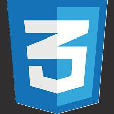
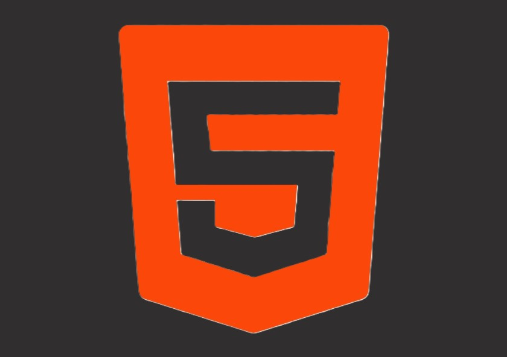
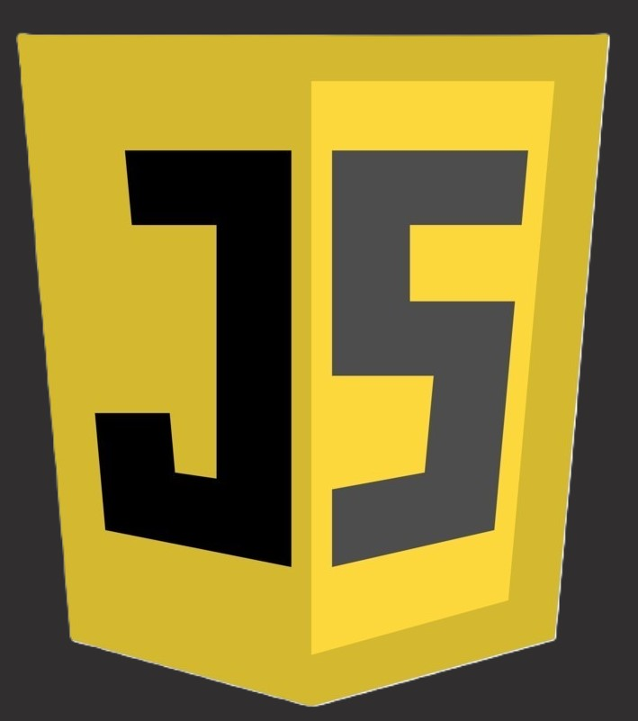
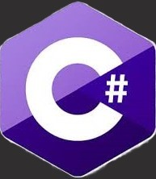

# My portfolio
## An introduction to myself, my knowledge and skills as fullstack developer.

#### 1. Home page with an introduction.  
#### 2. My projects page with my projects including link to project.  
#### 3. About me page an introduction of myself and my experiences in the branch. 
#### 4. My knowledge:   

      
      
      
    
    
#### 5. A form to contact me.  
#### 6. My references.  
#### 7. footer including links to my social media.

    

